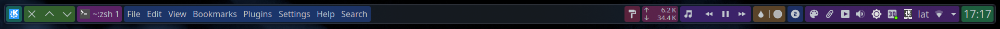
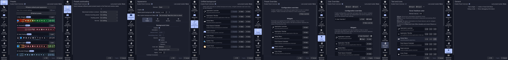
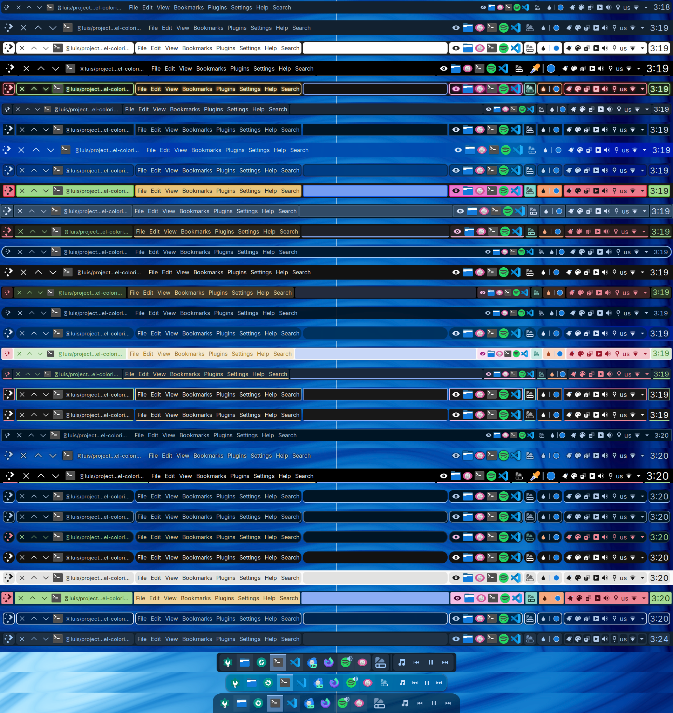

<div align="center">

# Panel Colorizer

[](https://aur.archlinux.org/packages/plasma6-applets-panel-colorizer)
[&color=1f425f&labelColor=2d333b&logo=kde&label=KDE%20Store)](https://store.kde.org/p/2130967)
[](https://repology.org/project/plasma-panel-colorizer/versions)
[](https://matrix.to/#/#kde-plasma-panel-colorizer:matrix.org)

Fully-featured widget to bring Latte-Dock and WM status bar customization features to the default Plasma panel.



</div>

> [!IMPORTANT]
> **Project is under active development. Watch out for BREAKING CHANGES in the [Release notes](https://github.com/luisbocanegra/plasma-panel-colorizer/releases)**.
>
> - Found a bug while using Panel Colorizer? Please report it [here](https://github.com/luisbocanegra/plasma-panel-colorizer/issues?q=sort%3Aupdated-desc+is%3Aissue+is%3Aopen) first, only report it to KDE after we conclude is a upstream issue or you removed the widget and can still reproduce the problem.
>
> - Make sure you're using the latest version of the widget and as close as possible to the [latest Plasma](https://kde.org/search/?s=KDE+Plasma6) to avoid compatibility issues.

> [!WARNING]
> [The C++ plugin may cause plasma to crash after an update](https://github.com/luisbocanegra/plasma-panel-colorizer/issues/209) and you will need to rebuild it, see [Installing](#installing).
>
> To temporarily recover from the crashes, you can manually remove the plugin:
>
> ```sh
> sudo rm -rf /usr/lib/qt6/qml/org/kde/plasma/panelcolorizer/ ~/.local/lib/qml/org/kde/plasma/panelcolorizer/
> ```

## Demo

[](https://www.youtube.com/watch?v=0QLyEexa9Y4) (outdated)

## Features

**Presets**

- [Built-in presets](https://github.com/luisbocanegra/plasma-panel-colorizer/tree/main/package/contents/ui/presets)
- Create your own presets
- Preset auto-loading
  - Fullscreen window
  - Maximized window
  - Window touching the panel
  - At least one window is shown on screen
  - Panel is floating
  - Normal (fall-back when none of the above are meet)
- [Advanced commandline usage with D-Bus (version 2.0.0 or later)](#advanced-commandline-usage-with-d-bus-version-200-or-later)

**Panel/Widget/System Tray elements**

- Color modes
  - Static
  - ~~Animated~~ removed in v1.0.0, might re-implement in a future version
- Background / Icons and text color
  - Custom
  - System
  - Custom list
  - Random
  - Follow parent background
- Shape
  - Spacing between widgets
  - Radius
  - Margins
  - Border
  - Shadow
- Blur behind (requires building and installing the C++ plugin)

**Force Text/Icon color**

- Force color to icons that don't follow the theme color for specific widgets
  - Mask for symbolic icons
  - Effect for colorful icons
- Periodic color refresh for widgets that reset colors when they update (e.g Global Menu)
- Recolor applications System Tray icons

**Panel background**

- Remove native panel background (transparent)
- Native panel background opacity
- Simulate an always floating panel

**Panel settings**

- Visibility
- Height
- Floating
- Location
- Length mode
- Alignment
- Opacity (Plasma 6.3.0)
- *EXPERIMENTAL* Sow/hide panel "AKA toggle panel" with D-Bus, stays hidden when hovering on screen edges

**Unified background**

- Join one or more widgets to make them visually connected

**Configuration overrides**

Overrides let you give a completely different configuration to one or more widgets

- Preset overrides (saved in the current preset)
- User overrides (sour own overrides that apply over the preset configuration and overrides)

</details>

## Installing

### KDE Store

1. Install these runtime dependencies or the equivalents for your distribution

   - Arch

       ```txt
       spectacle python python-dbus python-gobject
       ```

   - Fedora

       ```txt
       spectacle python3 python3-dbus python3-gobject
       ```

   - Kubuntu

       ```txt
       kde-spectacle python3 python3-dbus python3-gi
       ```

2. **Right click on the Panel** > **Add or manage widgets** > **Add new...** > **Download new...**
3. **Search** for "**Panel Colorizer**", install and add it to a Panel.

- ~~[Plasma 5](https://store.kde.org/p/2131149) version v0.2.0~~ **[No longer maintained](https://github.com/luisbocanegra/plasma-panel-colorizer/issues/10)**

- [Plasma 6](https://store.kde.org/p/2130967)

### Manually

1. Install these dependencies or the equivalents for your distribution

   - Arch

      ```txt
      git gcc cmake extra-cmake-modules libplasma spectacle python python-dbus python-gobject
      ```

   - Fedora

      ```txt
      git gcc-c++ cmake extra-cmake-modules libplasma-devel spectacle python3 python3-dbus python3-gobject
      ```

   - Kubuntu

      ```txt
      git build-essential cmake extra-cmake-modules libplasma-dev kde-spectacle python3 python3-dbus python3-gi
      ```

    Spectacle is needed to create preset previews

2. Clone and install

    ```sh
    git clone https://github.com/luisbocanegra/plasma-panel-colorizer
    cd plasma-panel-colorizer
    ```

   - Install widget + plugin

      ```sh
      ./install.sh
      ```

   - Install only the plugin if you already have the widget

      ```sh
      ./install-plugin.sh
      ```

#### Manual install for immutable distributions

Use the `-immutable` variants of the install script then add `QML_IMPORT_PATH` environment variable for the C++ plugin to work:

Create the file `~/.config/plasma-workspace/env/path.sh` (and folders if they don't exist) with the following:

```sh
export QML_IMPORT_PATH="$HOME/.local/lib64/qml:$HOME/.local/lib/qml:$QML_IMPORT_PATH"
```

Log-out or reboot to apply the change

For more information see <https://userbase.kde.org/Session_Environment_Variables>

### Arch Linux

[aur/plasma6-applets-panel-colorizer](https://aur.archlinux.org/packages/plasma6-applets-panel-colorizer) use your preferred AUR helper e.g:

```sh
yay -S plasma6-applets-panel-colorizer
```

### Nix package

For those using NixOS or the Nix package manager, a Nix package is available in nixpkgs-unstable.

To install the widget use one of these methods:

- NixOS

  ```nix
  environment.systemPackages = with pkgs; [
    plasma-panel-colorizer
  ];
  ```

- [Home-manager](https://github.com/nix-community/home-manager)

  ```nix
  home.packages = with pkgs; [
    plasma-panel-colorizer
  ];
  ```

- [Plasma-manager](https://github.com/nix-community/plasma-manager): If the widget gets added to a panel it will automatically be installed

- Other distros using Nix package manager

  ```sh
  # without flakes:
  nix-env -iA nixpkgs.plasma-panel-colorizer
  # with flakes:
  nix profile install nixpkgs#plasma-panel-colorizer
  ```

## How to use

1. Put the widget on any of your panels
2. Go to the widget settings to change the current panel appearance (right click > Configure...)
3. Widget can set to only show in panel **Edit Mode** (right click > Hide widget or from the widget settings)

### Creating and managing presets

Presets are a way to store the current configuration, it allows to quickly switch between styles and also to use them on other panels.

**How to manage presets**

1. To start creating a new preset you can either load an existing preset you want to edit or start clean by restoring the default appearance first.
2. Go to the other tabs and configure them however you like.
3. Go back to presets tab and either update the existing preset or create a new one.

When you apply a preset it overrides the currently applied configuration with the one of the preset, you can always save the current configuration as a different preset if you want to preserve it.

After loading a preset and editing any of the settings the new changes are not automatically written to the last loaded preset, instead you should go back to the presets tab and update it.

**Preset auto-loading**

The same applies to the preset auto-loading feature, if you are making changes to your presets it is recommended to temporary disable this feature so your unsaved edits don't get overwritten when a preset auto-loads.

### Advanced commandline usage with D-Bus (version 2.0.0 or later)

Each widget instance has its own D-bus name (e.g. luisbocanegra.panel.colorizer.c337.w2346), you can find it on each widget's General settings tab, you can also disable the service from there.

#### Switching presets with D-Bus

To apply a preset to a specific panel pass the absolute path of a preset folder:

```sh
qdbus6 luisbocanegra.panel.colorizer.c337.w2346 /preset preset /path/to/preset/dir/
```

It's also possible to apply the preset to all the panels at once

```sh
dbus-send --session --type=signal /preset luisbocanegra.panel.colorizer.all.preset string:"/path/to/preset dir/"
```

To quickly preview and switch between presets you can use this handy `fzf + qdbus6 + jq` one-liner

```sh
find /usr/share/plasma/plasmoids/luisbocanegra.panel.colorizer/contents/ui/presets/ ~/.local/share/plasma/plasmoids/luisbocanegra.panel.colorizer/contents/ui/presets/ ~/.config/panel-colorizer/presets -mindepth 1 -prune -type d 2>/dev/null -mindepth 1 -prune -type d | fzf --bind 'enter:execute(qdbus6 luisbocanegra.panel.colorizer.c337.w2346 /preset preset {})' --preview 'jq --color-output . {}/settings.json'
```

Or to all panels

```sh
find /usr/share/plasma/plasmoids/luisbocanegra.panel.colorizer/contents/ui/presets/ ~/.local/share/plasma/plasmoids/luisbocanegra.panel.colorizer/contents/ui/presets/ ~/.config/panel-colorizer/presets -mindepth 1 -prune -type d 2>/dev/null -mindepth 1 -prune -type d | fzf --bind 'enter:execute(dbus-send --session --type=signal /preset luisbocanegra.panel.colorizer.all.preset string:{})' --preview 'jq --color-output . {}/settings.json'
```

#### Changing specific configuration options with D-Bus

> [!CAUTION]
> There is no validation. Incorrectly formatted input will break the configuration! 💥

To apply a specific configuration option use the `property` method or signal with the value in [Dot notation](https://developer.mozilla.org/en-US/docs/Web/JavaScript/Reference/Operators/Property_accessors#dot_notation) + space + value

Example to toggle a panel

```sh
# hide
qdbus luisbocanegra.panel.colorizer.c337.w2346 /preset luisbocanegra.panel.colorizer.c337.w2346.property 'stockPanelSettings.visible {"enabled": true, "value": false}'
# to revert:
qdbus luisbocanegra.panel.colorizer.c337.w2346 /preset luisbocanegra.panel.colorizer.c337.w2346.property 'stockPanelSettings.visible {"enabled": false, "value": true}'
```

Just like with presets it's also possible to set a property on all the panels

```sh
# hide all panels
dbus-send --session --type=signal /preset luisbocanegra.panel.colorizer.all.property string:'stockPanelSettings.visible {"enabled": true, "value": false}'
# to revert:
dbus-send --session --type=signal /preset luisbocanegra.panel.colorizer.all.property string:'stockPanelSettings.visible {"enabled": false, "value": true}'
```

## Adding or improving the built-in presets

See [Adding or updating built-in presets](https://github.com/luisbocanegra/plasma-panel-colorizer/blob/main/package/contents/ui/presets/README.md)

## FAQ

### Are changes permanent?

Changes to the panel are not permanent and can be removed by disabling or removing the widget

### How to restore the default appearance?

- Click on the widget to disable/enable
- Or **Widget Settings** > **Top left** > **Enabled** checkbox
- Or removing the widget from the panel and restarting Plasma/logging out.

**If you are troubleshooting an issue please do the third option above and read the notice about reporting bugs at the start of [Install](https://github.com/luisbocanegra/plasma-panel-colorizer?tab=readme-ov-file#installing) section**

### Updated to v1.0.0 or later, where are my presets?

The location where they are stored has changed, the new locations are:

- Presets: `/home/$USER/.config/panel-colorizer/presets/`
- User overrides: `/home/$USER/.config/panel-colorizer/overrides.json`
- Text and icon options: `/home/$USER/.config/panel-colorizer/forceForegroundColor.json`

**The format of the presets has changed, presets from previous version will need to be recreated manually**

### Updated to v1.0.0 or later, how to blacklist widgets

See [How do I blacklist widgets like before?](https://github.com/luisbocanegra/plasma-panel-colorizer/discussions/146)

### Will you add support to drag/close/maximize/minimize... windows like latte had?

Not in this project, use [Panel Spacer Extended](https://github.com/luisbocanegra/plasma-panel-spacer-extended) instead

### How does it work?

This widget works by inject/managing the background and colors and other properties of other widgets and the panel where it is placed.

**Technical**

Backgrounds are drawn by creating rectangle areas bellow widgets/panel, text and icons repaint is done by editing some elements color property and overwriting `Kirigami.Theme.<something>Color` colors for others, while this works for most widgets, there are some that won't because they draw text and icons differently to what this project matches, if you find a widget that doesn't get colors let me know [here](https://github.com/luisbocanegra/plasma-panel-colorizer/issues/12) and I will try supporting it.

Time has passed and now the widget does a lot more than that, but the principle is basically the same.

**Performance**

I tried to optimize it so CPU usage only increases around 0.5-1% on my computer, usage may vary depending on your System or how many widgets are in your panels.

### Can this widget change the appearance of other parts of Plasma (e.g Desktop view, widget popups/tooltips, overview)

Only the panel for now, the Desktop widgets might be possible, for the others haven't looked into but most likely not.

## Bug reporting / Feature requests / Contributing

Please read the [Contributing guidelines in this repository](https://github.com/luisbocanegra/plasma-panel-colorizer/blob/main/CONTRIBUTING.md)

## Support the development

- If you like the project please consider donating/sponsoring this and [my other open source work](https://github.com/luisbocanegra?tab=repositories&q=&type=source&language=&sort=stargazers)

  [](https://github.com/sponsors/luisbocanegra) [](https://ko-fi.com/luisbocanegra) [](https://www.buymeacoffee.com/luisbocanegra) [](https://liberapay.com/luisbocanegra/) [](https://www.paypal.com/donate/?hosted_button_id=Y5TMH3Z4YZRDA)

- [Give it a star on GitHub](https://github.com/luisbocanegra/plasma-panel-colorizer)
- Rate / leave review in the [KDE Store](https://store.kde.org/p/2130967)

## Acknowledgements & useful resources

- [Search the actual gridLayout of the panel from Plasma panel spacer](https://invent.kde.org/plasma/plasma-workspace/-/blob/Plasma/5.27/applets/panelspacer/package/contents/ui/main.qml?ref_type=heads#L37) that inspired this project.
- [Google LLC. / Pictogrammers](https://pictogrammers.com/library/mdi/) assets used for panel icon.
- [sanjay-kr-commit/panelTransparencyToggleForPlasma6](https://github.com/sanjay-kr-commit/panelTransparencyToggleForPlasma6) / [psifidotos/paneltransparencybutton](https://github.com/psifidotos/paneltransparencybutton) for the implementation of panel transparency
- [olib14/pinpanel](https://github.com/olib14/pinpanel) for the hint on how to toggle a panel
- [Zren/plasma-applet-lib/kpac](https://github.com/Zren/plasma-applet-lib) to manage translations
- [KDE/plasma-desktop/desktoppackage/contents/views/Panel.qml](https://invent.kde.org/plasma/plasma-desktop/-/blob/master/desktoppackage/contents/views/Panel.qml?ref_type=heads)
- [KDE/plasma-workspace/master/shell/panelview.cpp](https://invent.kde.org/plasma/plasma-workspace/-/blob/master/shell/panelview.cpp?ref_type=heads)
- [Plasma scripting API](https://develop.kde.org/docs/plasma/scripting/api/)
- [Plasma Widget tutorial](https://develop.kde.org/docs/plasma/widget/)

## Screenshots

Configurations



Built-in presets


