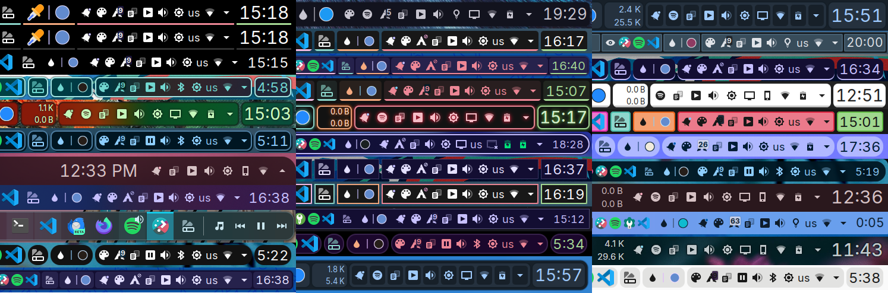

# Panel Colorizer

Powerful fully-featured KDE Plasma panel colorizer for a WM status bar like appearance

Inspired by the Latte Dock (now unmaintained) theming and boosted by the laziness to learn editing Plasma themes (which can only change background and other small things) created this project that helps you make the Plasma panels look _almost_ however you want.



## Demo

[](https://www.youtube.com/watch?v=0QLyEexa9Y4)

<details>
    <summary>Settings</summary>


</details>

## Features

### Presets

* Create your own configuration presets
* Restore defaults
* Preset auto-loading
  * Floating panel
  * Maximized window shown

### Widget Background

* Color modes
  * Static
  * Animated
    * Interval
    * Fading
* Colors
  * Custom
  * System
  * Custom list
  * Random
* Contrast correction
* Style
  * Spacing
  * Margin rules
  * Border radius
  * Outline
  * Opacity
  * Shadow
  * Line mode

### Icons and text

* Color Modes
  * Static
  * Interval
  * Follow widget background
* Colors
  * Custom
  * System
  * Custom list
  * Random
  * Contrast correction
* Opacity
* Blacklisted widgets color
* Force icon color to on specific plasmoids that use Kirigami.Icon
* Recolor applications tray icon

### Panel background

* Opacity
* Color
* Border radius
* Outline
* Constant floating panel side padding

> [!WARNING]
> Changing panel settings (position, alignment, width etc.) with this option enabled may cause some jankiness (including visual overflow or widget position freezes). Restarting Plasma or logging out may fix those, if not, disable it and logout to restore the original behavior.

* Shadow
* Remove original panel background

### Other

* Widget Blacklist

> [!NOTE]
> Changes to the panel are not permanent and can be removed by disabling them from widget settings or removing it from the panel and restarting Plasma or logging out.

## Installing

Install from KDE Store or use `Get new widgets..`

* ~~[Plasma 5](https://store.kde.org/p/2131149) version v0.2.0~~ **[No longer maintained](https://github.com/luisbocanegra/plasma-panel-colorizer/issues/10)**

* [Plasma 6](https://store.kde.org/p/2130967)

### Or manually

  1. Install these dependencies (please let me know if I missed something)

      ```txt
      cmake extra-cmake-modules libplasma plasma5support
      ```

  2. Run `./install.sh`

## How to use

1. Put the widget on any of your panels
2. Go to the widget settings to change the current panel appearance (right click > Configure...)
3. Widget can set to only show in panel **Edit Mode** (right click > Hide widget or from the widget settings)

## How it works / hacking

This widget works by inject/managing the background and colors of other widgets and the panel where it is placed, the initial goal was to replicate the famous WM status bar look and some Latte Dock theming options without actually modifying the panel/widgets source code.

### Technical

Background is drawn by creating rectangle areas bellow widgets/panel, text and icons repaint is done by editing some elements color property and overwriting `Kirigami.Theme.<something>Color` colors for others, while this works for most widgets, there are some that won't because they draw text and icons differently to what this project matches, if you find a widget that doesn't get colors let me know [here](https://github.com/luisbocanegra/plasma-panel-colorizer/issues/12) and I will try supporting it.

### Performance

Some widgets really like to create/destroy/recolor their own widget elements (e.g. Global Menu), to account for this, text and icons color are re-applied every 250ms. I tried to optimize it so CPU usage only increases around 1-2% on my computer, but usage could vary depending on your System or how many widgets are in your panels.

## Acknowledgements

* [Search the actual gridLayout of the panel from Plasma panel spacer](https://invent.kde.org/plasma/plasma-workspace/-/blob/Plasma/5.27/applets/panelspacer/package/contents/ui/main.qml?ref_type=heads#L37) code that inspired this project.
* [Google LLC. / Pictogrammers](https://pictogrammers.com/library/mdi/) for the panel icons.
* [sanjay-kr-commit/panelTransparencyToggleForPlasma6](https://github.com/sanjay-kr-commit/panelTransparencyToggleForPlasma6) / [psifidotos/paneltransparencybutton](https://github.com/psifidotos/paneltransparencybutton) for the true panel transparency
