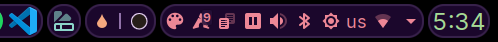

# Presets

| Preset Name | Preview |
|-------------|---------|
| Black |  |
| Black Color Lines |  |
| Black Gray Lines |  |
| Bliss |  |
| Bliss Light |  |
| Blur Widgets |  |
| Blur Widgets 2 |  |
| Carbon |  |
| ChromeOS |  |
| Default |  |
| Dock |  |
| Eclipse |  |
| Fake Floating |  |
| Fusion |  |
| Fusion 2 |  |
| Fusion 3 |  |
| Neon Lights |  |
| OG |  |
| Orbit |  |
| Outline |  |
| Outline Accent |  |
| Outline Colors |  |
| Pulse |  |
| Rounded Widgets |  |
| Rounded Widgets Floating |  |
| Rubik |  |
| Skeuomorphic 2 |  |
| Skeuomorphic white |  |
| Skittles |  |
| Sky |  |
| Sleek |  |
| Solid |  |
| Translucent |  |
| Transparent |  |
| White |  |

## Adding or updating built-in presets

Presets go inside `package/contents/ui/presets/`

Preset folder structure:

```sh
PresetName/
├── settings.json
└── preview.png
```

Preset `settings.json` must be edited only from the widget settings, to update an existing preset you need to make a copy of it first. The preview should match the style you get after applying it (except for the widgets that are in the panel of course).

When your preset is ready, copy the `settings.json` and `preview.png` to preset directory from `~/.config/panel-colorizer/presets/PresetName` to `package/contents/ui/presets/PresetName`.

After adding or renaming a preset run `./gen-presets-list-doc.sh` from the project root directory, this will update `package/contents/ui/presets/README.md` with the new preset(s).

***This file was auto-generated using `./gen-presets-list-doc.sh`***
